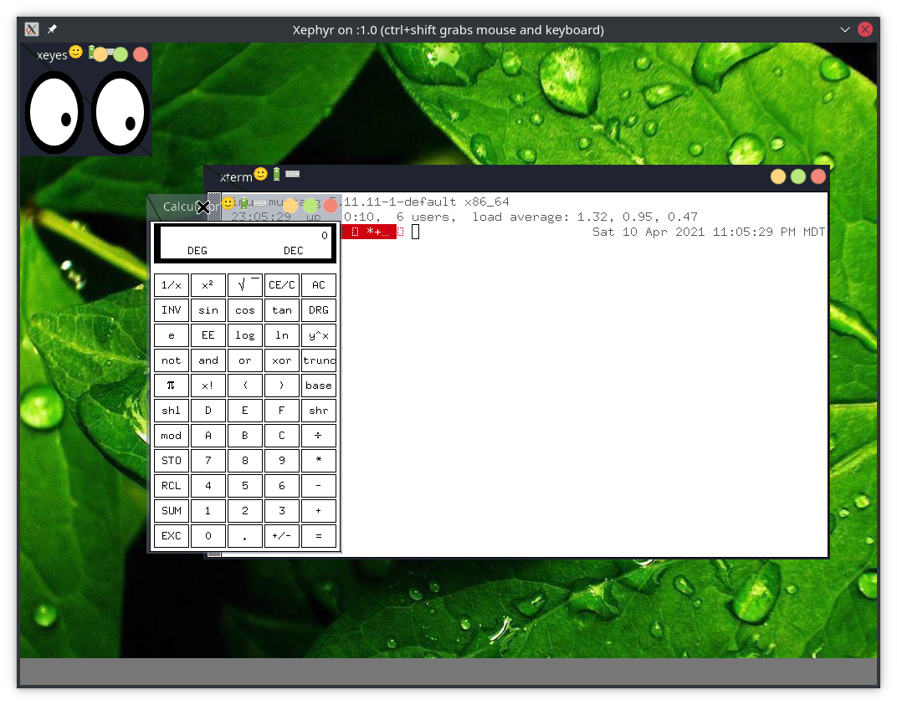

Troodon Desktop Environment
###########################

THIS IS A WORK IN PROGRESS!

Troodon is a Compositing X11 window manager. It uses XCB for communication
with the X Server and renders its decorations and built-in desktop
environment apps and components with OpenGL.

Troodon can be used in both tiling and stacking modes, and the best part is
that it is a single binary!

Troodon Philosophy
##################

* Minimize Dependencies

Software Used
#############
* GID

  * https://github.com/zertovitch/gid
  * License: MIT
  * Author: Gautier de Montmollin

Dependencies
############
These are all pretty normal X11/OpenGL packages/libraries that should be
present in most Linux distributions.

* Xorg
* XLib
* XCB
* GL
* GLX
* Freetype
* Fontconfig

FAQ
###

**What's a Troodon?**

  Troodon was a small dinosaur, regarded as the most intelligent of the
  dinosaur species and that with the highest visual acuity.

Developer Notes
###############

Generate Ada spec for glext.h with:

.. code-block::

   g++ -c -fdump-ada-spec -DGL_GLEXT_PROTOTYPES /usr/include/GL/gl.h

To watch for X resource leaks, use:

.. code-block::

   xrestop

Necessary Developer Libs
########################
This will depend on your distribution, Ubuntu uses these package names:

* libfontconfig1-dev
* libfreetype6-dev
* libglx-dev
* libgl-dev
* libgl1-mesa-dev
* libx11-dev
* libx11-xcb-dev
* libxcb-composite0-dev
* libxcb-ewmh-dev
* libxcb-glx0-dev
* libxcb-randr0-dev
* libxcb-render0-dev
* libxcb-shape0-dev
* libxcb-xfixes0-dev
* libxcb-xinerama0-dev
* libxcb1-dev
* x11proto-dev
* x11proto-core-dev

TODOs
#####
* Edit includes to use sane Ada Interface types like Unsigned_8, etc.
* Use Fontconfig to identify fonts, use normal font strings w/ fallbacks.
* sprinkle glGetError all over the place.
* Optimize font rendering with texture atlas
* Make frame close when underlying window closes
* Usable buttons and widgets
* [DONE] Add ability to make whole window transparent (i.e. when dragging, or just for eye candy)
* Add drop shadows/glow to window edges
* Rendering optimization
